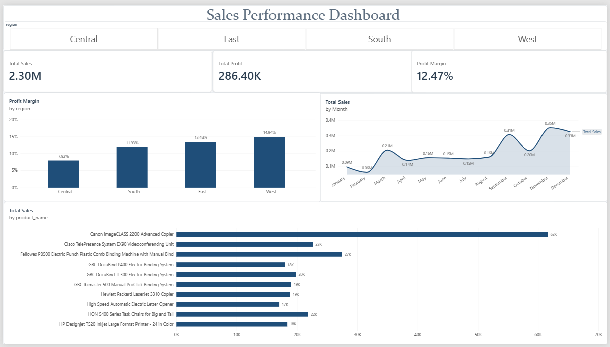
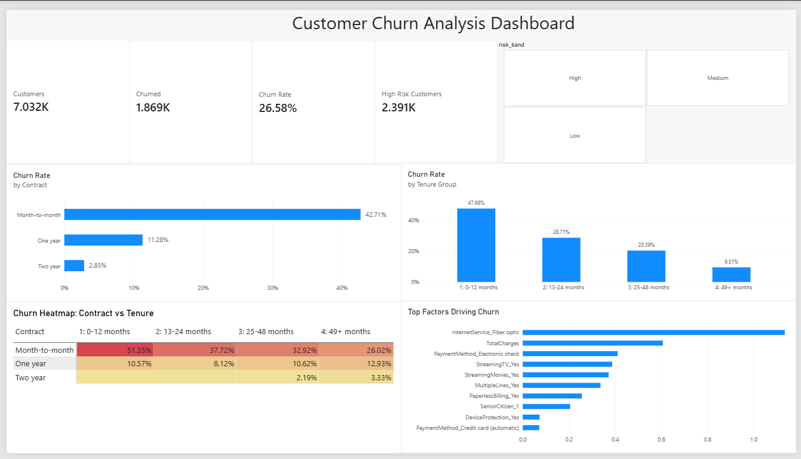

# Data Analyst Portfolio

Hi, I'm Yash zade, an aspiring data analyst. This repository contains my portfolio projects built with SQL, Excel, Python and Power BI.

## Projects

### 1. Sales Performance Dashboard
Analysis of 9,994 retail orders (2014-2017) to find which regions underperform and which products drive sales.

[Open the full project](Project1-sales-dashboard)

### 2. Customer Churn Analysis

Analysis of 7,032 telecom customers to find who leaves and why. 26.58% churned overall, rising to 42.71% on month-to-month contracts. Includes SQL analysis, a Python prediction model (79% recall, ROC-AUC 0.835) and a Power BI dashboard.

[Open the full project](Project2-churn-analysis)

### 3. E-commerce Funnel Analysis
Coming soon.
